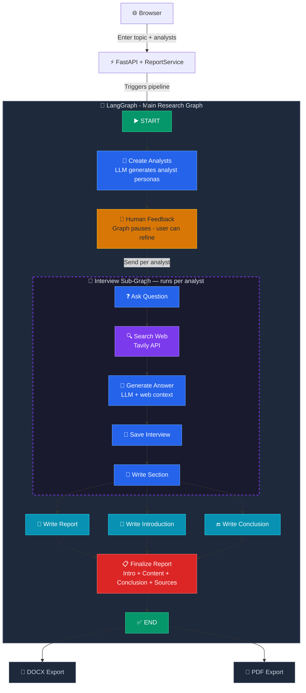

# R3 - Autonomous Research Report Generator

An AI-powered multi-agent system that autonomously researches any topic, conducts interviews with AI analyst personas, searches the web for sources, and generates comprehensive research reports in DOCX and PDF formats.

Built with **LangGraph** for multi-agent orchestration and **FastAPI** for the web interface.

---

## Features

- **Multi-Agent Research** - Creates AI analyst personas, each with a unique perspective on the topic
- **Automated Web Search** - Searches the web using Tavily API to gather real-time information
- **Interview Simulation** - Each analyst conducts a structured interview with an AI expert
- **Report Generation** - Compiles all findings into a structured report with introduction, content, conclusion, and sources
- **Export Formats** - Download reports as DOCX or PDF
- **User Authentication** - Secure login/signup with bcrypt password hashing
- **Multi-LLM Support** - Switch between Google Gemini, Groq (LLaMA), and OpenAI with a single config change
- **Structured Logging** - JSON-formatted logs with structlog for easy debugging

---

## Architecture



> 📌 **Interactive version**: Open `static/workflow_diagram.html` in your browser for a detailed visual diagram with hover effects.

---

## Tech Stack

| Layer | Technology |
|-------|-----------|
| **Frontend** | Jinja2 Templates, HTML, CSS |
| **Backend** | FastAPI, Uvicorn |
| **AI Orchestration** | LangGraph |
| **LLM Providers** | Google Gemini 2.0 Flash, Groq LLaMA 3.3-70b, OpenAI GPT-4o |
| **Web Search** | Tavily API |
| **Database** | SQLite + SQLAlchemy |
| **Authentication** | Passlib + bcrypt |
| **Logging** | structlog (JSON) |
| **Report Export** | python-docx, ReportLab |

---

## Project Structure

```
r3/
├── src/
│   ├── api/                        # FastAPI web application
│   │   ├── main.py                 # App setup, CORS, templates
│   │   ├── router/
│   │   │   └── routes.py           # Auth & report endpoints
│   │   ├── models/
│   │   │   └── model_requests.py   # Pydantic request models
│   │   ├── services/
│   │   │   └── report_service.py   # Business logic layer
│   │   └── templates/              # Jinja2 HTML templates
│   │       ├── login.html
│   │       ├── signup.html
│   │       ├── dashboard.html
│   │       └── report_progress.html
│   │
│   ├── backend_server/             # LangGraph workflow engine
│   │   ├── model.py                # State models (Analyst, Perspectives, etc.)
│   │   └── workflow.py             # AutonomousReportGenerator
│   │
│   ├── config/
│   │   └── configuration.yaml      # LLM & embedding settings
│   │
│   ├── database/
│   │   └── database_config.py      # SQLAlchemy setup, User model
│   │
│   ├── prompt_lib/
│   │   └── prompt.py               # Jinja2 prompt templates for LLM
│   │
│   ├── utils/
│   │   ├── config_loader.py        # YAML config loader
│   │   └── model_loader.py         # LLM & embedding model loader
│   │
│   ├── logger/
│   │   └── custom_logger.py        # structlog JSON logger
│   │
│   └── exception/
│       └── custom_exception.py     # Custom exception with traceback
│
├── static/
│   └── css/
│       └── styles.css              # Dark theme UI styles
│
├── generated_report/               # Output directory for reports
├── logs/                           # Timestamped JSON log files
├── .env                            # API keys (not in git)
├── requirements.txt                # Python dependencies
├── pyproject.toml                  # Project metadata
└── README.md
```

---

## Getting Started

### Prerequisites

- Python 3.13+
- API keys for at least one LLM provider (Groq, Google, or OpenAI)
- Tavily API key for web search

### 1. Clone the Repository

```bash
git clone https://github.com/Uskamolla/r3.git
cd r3
```

### 2. Create Virtual Environment

```bash
python -m venv agent_env
source agent_env/bin/activate    # macOS/Linux
agent_env\Scripts\activate       # Windows
```

### 3. Install Dependencies

```bash
pip install -r requirements.txt
```

### 4. Set Up Environment Variables

Create a `.env` file in the project root:

```env
LLM_PROVIDER=groq                    # Options: groq, google, openai

GROQ_API_KEY=your_groq_api_key
GOOGLE_API_KEY=your_google_api_key
TAVILY_API_KEY=your_tavily_api_key

# Optional
OPENAI_API_KEY=your_openai_api_key
```

**Where to get API keys:**
- **Groq**: [console.groq.com](https://console.groq.com)
- **Google Gemini**: [aistudio.google.com/apikey](https://aistudio.google.com/apikey)
- **Tavily**: [app.tavily.com](https://app.tavily.com)
- **OpenAI**: [platform.openai.com](https://platform.openai.com)

### 5. Run the Application

```bash
uvicorn src.api.main:app --reload
```

Visit [http://localhost:8000](http://localhost:8000) in your browser.

---

## Usage

1. **Sign up** - Create an account at `/signup`
2. **Log in** - Enter your credentials at `/`
3. **Dashboard** - Enter a research topic and select the number of analysts (1-5)
4. **Generate** - Click "Generate Report" and wait for the AI to research your topic
5. **Feedback** - Optionally provide feedback to refine the report
6. **Download** - Download the final report as DOCX or PDF

---

## Configuration

### Switching LLM Providers

Change the `LLM_PROVIDER` value in `.env`:

```env
LLM_PROVIDER=groq      # Groq LLaMA 3.3-70b (free tier: 12k tokens/min)
LLM_PROVIDER=google    # Google Gemini 2.0 Flash (free tier: 1500 req/day)
LLM_PROVIDER=openai    # OpenAI GPT-4o (paid)
```

### Model Settings

Edit `src/config/configuration.yaml`:

```yaml
llm:
  groq:
    provider: "groq"
    model_name: "llama-3.3-70b-versatile"
    temperature: 0
    max_output_tokens: 2048

  google:
    provider: "google"
    model_name: "gemini-2.0-flash"
    temperature: 0
    max_output_tokens: 2048
```

---

## API Endpoints

| Method | Endpoint | Description |
|--------|----------|-------------|
| GET | `/` | Login page |
| POST | `/login` | Authenticate user |
| GET | `/signup` | Signup page |
| POST | `/signup` | Create new account |
| GET | `/dashboard` | Main dashboard (requires login) |
| POST | `/generate_report` | Start report generation |
| POST | `/submit_feedback` | Submit feedback on report |
| GET | `/download/{file_name}` | Download generated report |
| GET | `/health` | Health check endpoint |

---

## Deployment (In Progress)

### Docker (Coming Soon)

```dockerfile
# Dockerfile - To be added
FROM python:3.13-slim
WORKDIR /app
COPY requirements.txt .
RUN pip install --no-cache-dir -r requirements.txt
COPY . .
EXPOSE 8000
CMD ["uvicorn", "src.api.main:app", "--host", "0.0.0.0", "--port", "8000"]
```

### Environment Setup for Production

- [ ] Add Dockerfile and docker-compose.yml
- [ ] Switch from SQLite to PostgreSQL for production database
- [ ] Replace in-memory session store with Redis or JWT tokens
- [ ] Add persistent checkpointing (replace MemorySaver with database-backed storage)
- [ ] Set up HTTPS with reverse proxy (Nginx)
- [ ] Configure CORS with specific allowed origins (not `*`)
- [ ] Add rate limiting middleware
- [ ] Set up CI/CD pipeline
- [ ] Add unit and integration tests

### Cloud Deployment Options

| Platform | Notes |
|----------|-------|
| **Railway** | Easy deployment, supports Python + SQLite |
| **Render** | Free tier available, auto-deploy from GitHub |
| **AWS EC2** | Full control, requires manual setup |
| **Google Cloud Run** | Serverless, scales to zero |
| **Docker + VPS** | Any VPS provider with Docker support |

---

## Free Tier Rate Limits

| Provider | Model | Tokens/min | Requests/day |
|----------|-------|-----------|-------------|
| Groq | llama-3.3-70b-versatile | 12,000 | Unlimited |
| Google | gemini-2.0-flash | 1,000,000 | 1,500 |
| OpenAI | gpt-4o | Paid | Paid |

> **Tip**: Start with 1 analyst to stay within free tier limits. More analysts = more LLM calls.

---

## Logs

Logs are stored in `/logs/` as timestamped JSON files:

```
logs/
├── 02_28_2026_17_04_27.log
├── 02_28_2026_19_10_26.log
└── ...
```

Each log entry is structured JSON:

```json
{
  "timestamp": "2026-02-28T18:10:51.253Z",
  "level": "info",
  "event": "Starting report pipeline",
  "module": "ReportService",
  "topic": "gen ai in healthcare",
  "thread_id": "1bce2bb4-0cf0-4b58-921c-9abfc06eb79b"
}
```

---
